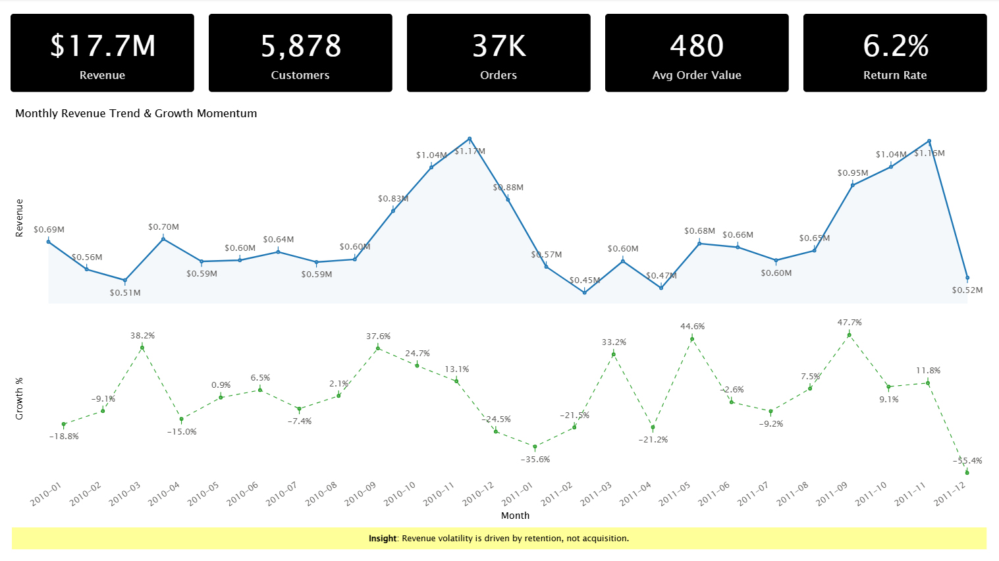
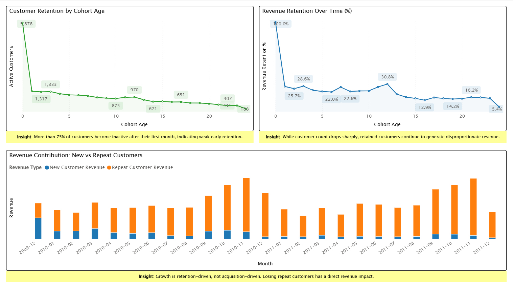
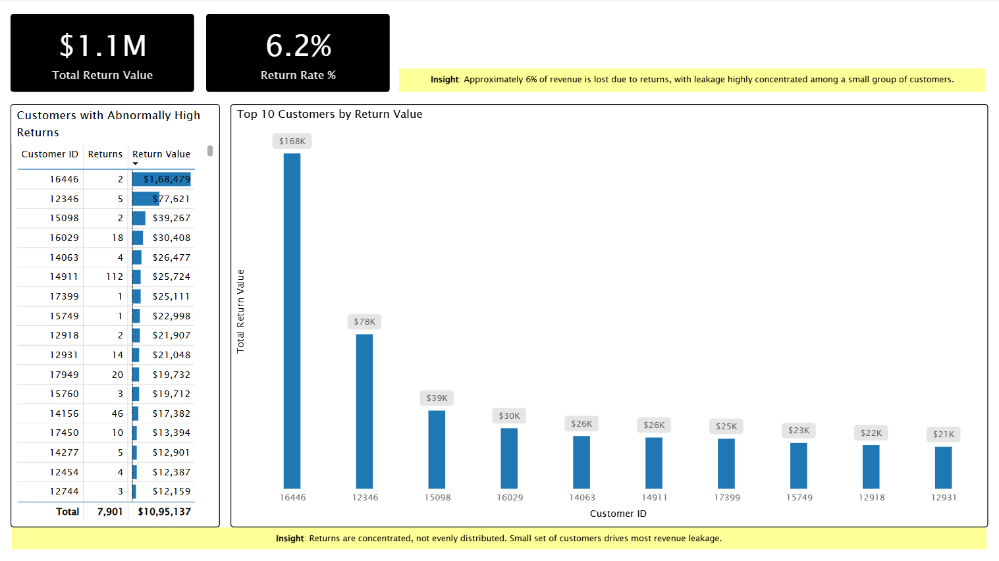

# Customer Retention & Revenue Leakage Analysis  
(SQL + Power BI)

## 📌 Project Overview
This project analyzes **customer retention, revenue trends, and revenue leakage due to returns** using a real-world online retail dataset.

Instead of focusing only on topline revenue, the analysis answers deeper business questions:
- Why does revenue fluctuate?
- How quickly do customers churn?
- Is growth driven by new or repeat customers?
- How much revenue is silently lost through returns?

The project follows a **production-style analytics pipeline**:  
**Raw Data → SQL Fact Views → Analytical Aggregations → Power BI Dashboards**

---

## 🛠 Tech Stack
- **Database:** MySQL  
- **Querying & Modeling:** SQL (Views, CTEs, Window Functions)  
- **Visualization:** Power BI  
- **Data Source:** Public Online Retail transactional dataset (`online_retail.csv`)

---

## 📂 Data Architecture & Design

### 🔹 Raw Data Layer
- Raw CSV data ingested into MySQL **without modification**
- All columns stored as **TEXT** to preserve source fidelity
- Table: `online_retail`

> Mirrors real-world ingestion pipelines where raw data is never mutated.

---

### 🔹 Fact Layer (Business Events)

| View Name | Description |
|---------|-------------|
| `fact_sales` | Completed sales transactions only |
| `fact_returns` | Returns / cancellations modeled as a **separate fact** |

**Key design decisions:**
- Sales and returns are **never mixed**
- Revenue calculated in SQL
- All cleaning, casting, and logic handled in views
- Raw data remains untouched

---

### 🔹 Aggregated Facts & Dimensions

| View Name | Purpose |
|----------|---------|
| `fact_invoice_summary` | Invoice-level metrics (revenue, quantity, products) |
| `dim_customer_metrics` | Customer lifetime metrics (orders, revenue, tenure) |

These views form the **analytical backbone**.

---

### 🔹 Power BI Optimized Views

| View Name | Business Purpose |
|----------|------------------|
| `bi_kpi_overview` | Executive KPIs |
| `bi_monthly_revenue` | Monthly revenue & MoM growth |
| `bi_new_vs_repeat_revenue` | New vs repeat revenue |
| `bi_customer_retention` | Customer retention by cohort age |
| `bi_revenue_retention` | Revenue retention (value decay) |
| `bi_returns_overview` | Returns & return rate |
| `bi_high_return_customers` | High-risk return customers |

> All business logic lives in SQL.  
> Power BI is used **only for visualization and storytelling**.

---

## 🔍 Key Business Questions Answered
- How healthy is the business beyond topline revenue?
- What percentage of customers churn after their first purchase?
- Is growth driven by acquisition or retention?
- How does customer revenue decay over time?
- How much revenue is lost due to returns?
- Are returns concentrated among specific customers?

---

## 📊 Core Analyses Performed

### 1️⃣ Business Health (KPIs)
- Total Revenue
- Total Customers
- Total Orders
- Average Order Value (AOV)

### 2️⃣ Customer Behavior
- One-time vs repeat customers
- Order frequency patterns
- Customer lifetime metrics

### 3️⃣ Retention & Cohort Analysis
- Customer retention by cohort age
- Revenue retention curve (value decay)
- Early churn identification

### 4️⃣ Revenue Trends
- Monthly revenue trends
- Month-over-Month (MoM) growth using window functions
- Seasonality and volatility analysis

### 5️⃣ Revenue Leakage (Returns)
- Total return value
- Return rate (% of revenue lost)
- High-risk customers with excessive returns

---

## 📈 Power BI Dashboard (Executive Storytelling)

### 🖥 Dashboard Pages

#### 1️⃣ Executive Overview

- Revenue, Customers, Orders, AOV
- Monthly Revenue Trend & Growth Momentum
- Key insight: **Revenue volatility is driven by retention, not acquisition**

---

#### 2️⃣ Retention & Growth Quality

- Customer retention curve
- Revenue retention (value decay)
- New vs Repeat customer revenue contribution

---

#### 3️⃣ Revenue Leakage (Returns)

- Total return value & return rate
- High-risk return customers
- Concentration of revenue leakage

---

## 💡 Key Insights
- Over **75% of customers churn after their first month**
- Revenue depends heavily on repeat customers
- Customer revenue decays sharply over time
- Revenue shows volatility driven by retention quality
- Approximately **6% of total revenue is lost due to returns**
- Returns are highly concentrated among a small group of customers

**Conclusion:**  
Improving **customer retention and post-purchase experience** offers a significantly higher ROI than focusing solely on acquisition.

---

## 🧠 Skills Demonstrated
- SQL data cleaning & transformation
- Fact vs dimension modeling
- CTEs and window functions
- Cohort & retention analysis
- Revenue leakage modeling
- Analytical data modeling
- Power BI executive dashboards
- Business-first data storytelling

---

## 🚀 Future Enhancements
- Product-level return analysis
- RFM customer segmentation
- Predictive churn modeling
- Marketing or logistics data integration
- Migration to full warehouse schema (if required)

---

## 👤 Author
**Indranil Bhosale**  
Aspiring Data Analyst  
SQL • Power BI • Analytics
